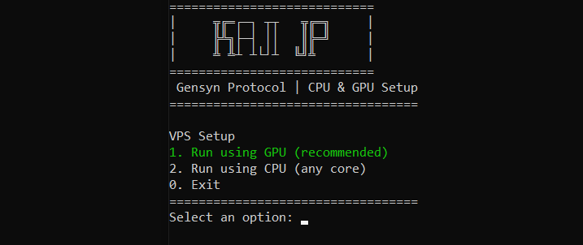

# Gensyn Protocol
Gensyn - Testnet Setup and Tutorial for Running Gensyn on a GPU or CPU VPS.<br><br>
<br>
Untuk Tutorial Bahasa Indonesia, kunjungi [Youtube KajiJP - Tutorial Gensyn Bahasa Indonesia](https://cloud.vast.ai/?ref_id=62897&creator_id=62897&name=PyTorch%20(Vast)) <br><br>

# Run RL Swarm (Testnet) Node
RL Swarm is a fully open-source framework developed by GensynAI for building reinforcement learning (RL) training swarms over the internet. This guide walks you through setting up an RL Swarm node and a web UI dashboard to monitor swarm activity.

## Hardware Requirements
There are currently multiple swarms running on the Testnet, each training on a different data set. The current list of available models and swarms include:
* Models: `Qwen 2.5 0.5B`, `Qwen 2.5 1.5B`, `Qwen 2.5 7B`, `Qwen 2.5 32B (4 bit)` & `Qwen 2.5 72B (4 bit)`
* Swarms: `Math (GSM8K dataset)` & `Math Hard (DAPO-Math 17K dataset)`

Your hardware requirements will vary depending on which swarm and model you choose. Users with less powerful hardware should select a smaller model (e.g. Qwen 0.5B or 1.5B) and smaller dataset (GSM8K) `A`. Users with more powerful hardware can select a larger model (e.g. Qwen 7B, 32B or 72B) and larger dataset (DAPO-Math 17K) `B`. The requirements for each are listed below:

### Small model (0.5B or 1.5B) + Math (GSM8K dataset)
* `CPU-only`: arm64 or x86 CPU with minimum 16gb ram (note that if you run other applications during training it might crash training).

OR

* `GPU`: 
  * RTX 3090
  * RTX 4090
  * A100
  * H100
  * `≥24GB vRAM` GPU is recommended, but Gensyn now supports `<24GB vRAM` GPUs too.
  * `≥12.4` CUDA Driver

### Big model (7B, 32B or 72B) + Math Hard (DAPO-Math 17K dataset)
* `GPU`: A100 (80GB) or H100 (80GB)
  
<br><br><br>

# Running on Linux
### Clone this repo & extrac to local
```
apt update && apt install -y wget unzip && wget https://github.com/kajijp/gensyn-protocol/archive/refs/heads/main.zip && unzip main.zip && mv gensyn-protocol-main gensyn-protocol && cd gensyn-protocol && chmod +x setup.sh && ./setup.sh
```

### Choose installer
- Choose option 1 to run using **GPU-VPS** (recommended).
- Choose option 2 to run using **CPU-VPS**.<br><br>

> ⚠️ **IMPORTANT:** if you run using GPU-VPS, the minimum GPU is RTX 3090 with CUDA 12.7 Version.  
> For affordable and reliable GPU VPS, we recommend using [Vast.ai](https://cloud.vast.ai/?ref_id=62897&creator_id=62897&name=PyTorch%20(Vast)) with PyTorch as default setting.

## Get HuggingFace Access token
1- Create account in [HuggingFace](https://huggingface.co/)

2- Create an Access Token with `Write` permissions [here](https://huggingface.co/settings/tokens) and save it

## 5) Login
**1- You have to receive `Waiting for userData.json to be created...` in logs**


**2- Open login page in browser**
* **Local PC:** `http://localhost:3000/`
* **GPU Cloud Users:** Before conneting to your GPU, Add this flag: `-L 3000:localhost:3000` in front of your GPU's SSH Command, to be able to open `http://localhost:3000/` in your Local PC's browser.
* **VPS users:** You have to forward port by entering a command in the `Windows Powershell` of your local PC:
  * In windows start menu, Search **Windows Powershell** and open its terminal in your local PC.
  * Enter the command below and replace your vps ip with `Server_IP` and your vps port(.eg 22) with `SSH_PORT`
  ```
  ssh -L 3000:localhost:3000 root@Server_IP -p SSH_PORT
  ```
  * ⚠️ Make sure you enter the command in your own local PC's Windows Powershell and NOT your VPS terminal.
  * This prompts you to enter your VPS password, when you enter it, you connect and tunnel to your vps
  * Now go to browser and open `http://localhost:3000/` and login

**3- Login with your preferred method**


* After login, your terminal starts installation.

**4- Optional: Push models to huggingface**
* Enter your `HuggingFace` access token you've created when it prompted.
* This will need `2GB` upload bandwidth for each model you train, you can pass it by entering `N`.


---

### Node Name
* Now your node started running, Find your name after word `Hello`, like mine is `whistling hulking armadillo` as in the image below (You can use `CTRL+SHIFT+F` to search Hello in terminal)


---

### Screen commands
* Minimize: `CTRL` + `A` + `D`
* Return: `screen -r swarm`
* Stop and Kill: `screen -XS swarm quit`

---

## Backup
**You need to backup `swarm.pem`**.
### `VPS`:
Connect your VPS using `Mobaxterm` client to be able to move files to your local system. Back up these files:**
* `/root/rl-swarm/swarm.pem`

### `WSL`:
Search `\\wsl.localhost` in your ***Windows Explorer*** to see your Ubuntu directory. Your main directories are as follows:
* If installed via a username: `\\wsl.localhost\Ubuntu\home\<your_username>`
* If installed via root: `\\wsl.localhost\Ubuntu\root`
* Look for `rl-swarm/swarm.pem`
---

# Node Health
### Official Dashboards
* Math (GSM8K dataset): https://dashboard-math.gensyn.ai/
* Math Hard (DAPO-Math 17K dataset): https://dashboard-math-hard.gensyn.ai/


### Telegram Bot
Search you `Node ID` here with `/math` here: https://t.me/gensynImpek_bot
* `Node-ID` is near your Node name


* ⚠️ If receiving `EVM Wallet: 0x0000000000000000000000000000000000000000`, your `onchain-participation` is not being tracked and you have to Install with `New Email` and ***Delete old `swarm.pem`***


---

# Update Node
### 1- Stop Node
```console
# list screens
screen -ls

# kill swarm screens (replace screen-id)
screen -XS screen-id quit

# You can kill by name
screen -XS swarm quit
```

### 2- Update Node Repository
**Method 1** (test this first): If you cloned official repo with no local changes:
```bash
cd rl-swarm
git pull
```

**Method 2**: If you cloned official repo with local Changes:
```console
cl rl-swarm

# Reset local changes:
git reset --hard
# Pull updates:
git pull

# Alternatively:
git fetch
git reset --hard origin/main
```
* You have to do your local changes again.

**Method 3**: Cloned unofficial repo or Try from scratch (**Recommended**):
```console
cd rl-swarm

# backup .pem
cp ./swarm.pem ~/swarm.pem

cd ..

# delete rl-swarm dir
rm -rf rl-swarm

# clone new repo
git clone https://github.com/gensyn-ai/rl-swarm

cd rl-swarm

# Recover .pem
cp ~/swarm.pem ./swarm.pem
```
* If you had any local changes, you have to do it again.

### 3- Re-run Node
Head back to [Run the swarm](https://github.com/kajijp/gensyn-protocol/blob/main/README.md#choose-installer) and re-run Node.

---

# Troubleshooting:

### CPU Configuration
Fix 1:
```
cd rl-swarm

nano hivemind_exp/configs/mac/grpo-qwen-2.5-0.5b-deepseek-r1.yaml
```
* Change `bf16` value to `false`
* Reduce `max_steps` to `5`

Fix 2: 
Use this as a run command instead:
```
python3 -m venv .venv
source .venv/bin/activate
export PYTORCH_MPS_HIGH_WATERMARK_RATIO=0.0 && ./run_rl_swarm.sh
```

### ⚠️ Stuck at loading localhost page
```bash
cd rl-swarm

sed -i '/^  return (/i\  useEffect(() => {\n    if (!user && !signerStatus.isInitializing) {\n      openAuthModal();\n    }\n  }, [user, signerStatus.isInitializing]);\n\n' modal-login/app/page.tsx
```

### ⚠️ Error: PS1 unbound variable
```
sed -i '1i # ~/.bashrc: executed by bash(1) for non-login shells.\n\n# If not running interactively, don'\''t do anything\ncase $- in\n    *i*) ;;\n    *) return;;\nesac\n' ~/.bashrc
```

### ⚠️ Daemon failed to start in 15.0 seconds
* Enter `rl-swarm` directory:
```bash
cd rl-swarm
```
* Activate python venv:
```bash
python3 -m venv .venv
source .venv/bin/activate
```
* Open Daemon config file:
```
nano $(python3 -c "import hivemind.p2p.p2p_daemon as m; print(m.__file__)")
```
* Search for line: `startup_timeout: float = 15`, then change `15` to `120` to increate the Daemon's timeout. the line should look like this: `startup_timeout: float = 120`
* To save the file: Press `Ctrl + X`, `Y` & `Enter`
